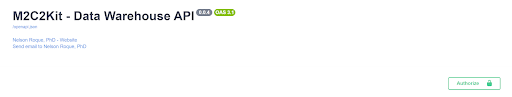
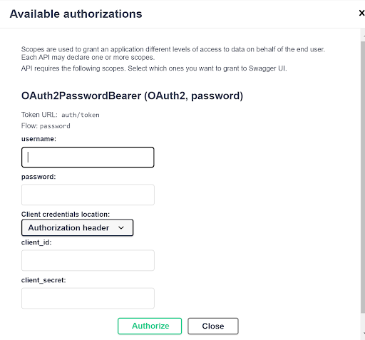
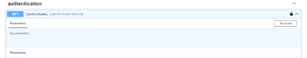
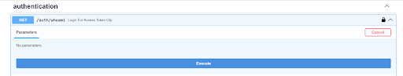

# Getting Started - Authorization

* Note: This authorization process will need to be completed by each team member who wants to use the Jupyter Notebook.  

* Go to this URL: [https://prod.m2c2kit.com/docs#/authentication/sign_up_auth_register_post](https://prod.m2c2kit.com/docs#/authentication/sign_up_auth_register_post)  

* Fill out the fields except for client id, client secret, scope, and grant type. 

* Click ‘Try it out’  

* Contact our team to add the study name to our system by filling out this study form: 

* Wait for us to confirm that you have been successfully added. 
* Once you have been confirmed to have been authorized and the study has been added, click ‘Authorize’ located at the very top of the form and input your username and password.  

* Once this is confirmed, close this pop-up window.  

* Next, go to whoami endpoint (located under authentication) and expand the window by hitting the down arrow. This will expose more content.
   
* Click on ‘try it out’ in the top-right-hand corner.

* Then, select ‘Execute’. 

* Your information will be displayed below (see example)

")

* Next, email [m2c2@psu.edu](mailto:m2c2@psu.edu) or fill out our Airtable form to capture details about your study, and who should be allowed to pull data.
* You are now ready to use the Jupyter Notebook:  \
 \
[https://github.com/m2c2-project/m2c2kit-integration-guides/blob/main/jupyter_notebooks/M2C2Kit_Data_Query_Notebook.ipynb](https://github.com/m2c2-project/m2c2kit-integration-guides/blob/main/jupyter_notebooks/M2C2Kit_Data_Query_Notebook.ipynb)  

    * Follow the guide and download the Jupyter Notebook from the GitHub repo to use on your device.  
