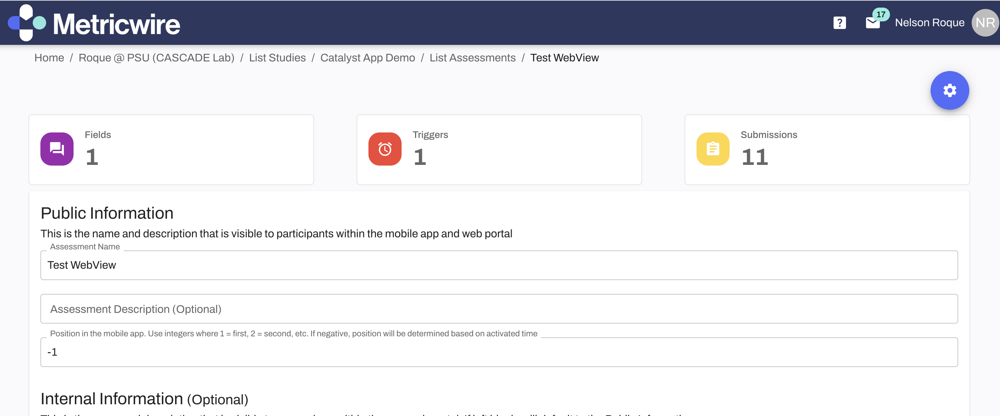

# About this Repository

With the web-based implementation of M2C2kit assessments, it is possible for them to be embedded via Qualtrics, REDCAP, and Metricwire (as well as anything else with a WebView).

This documentation page contains an implementation guide for using Metricwire. 

## Getting Started - Using the M2C2kit Production Server

1. Login to Metricwire Catalyst | [https://catalyst.metricwire.com/](https://catalyst.metricwire.com/)

2. Create or edit an Assessment



3. Add a Field of type 'WebView' within the assessment


4. Enable `catalyst_next_button` event to go next


5. Enter the cognitive assessment URL(s) from our documentation below. Make sure to modify URL to include magic params that inject identifiers from Metricwire:

**`|*participantUserId*|` = participant_id (Participant Identifier)** <br>
**`|*submissionSessionId*|` = session_id (Session Identifier)** <br>
**`metricwire` = admin_type (Admistrative Type)** <br>

Note. Make sure to update the **activity_name** for each cognitive assessment you want to use. Also, you will likely want to change the **number_of_trials** for each cognitive assessment. For testing purposes, you may want to keep this as is (number_of_trials=2) and update this later.

- activity_name possible values: `symbol-search`, `grid-memory`, `color-shapes`, `color-dots`


**For example URLs, see this list of links:**
[sample_metricwire_urls.txt](sample_metricwire_urls.txt) or links below

```
https://prod.m2c2kit.com/m2c2kit/nt/index.html?activity_name=symbol-search&study_id=demo&width=400&height=1000&api_key=demo&number_of_trials=2::int&show_quit_button=false::boolean&participant_id=|*participantUserId*|&session_id=|*submissionSessionId*|&admin_type=metricwire
https://prod.m2c2kit.com/m2c2kit/nt/index.html?activity_name=color-shapes&study_id=demo&width=400&height=1000&api_key=demo&number_of_trials=2::int&show_quit_button=false::boolean&participant_id=|*participantUserId*|&session_id=|*submissionSessionId*|&admin_type=metricwire
https://prod.m2c2kit.com/m2c2kit/nt/index.html?activity_name=color-dots&study_id=demo&width=400&height=1000&api_key=demo&number_of_trials=2::int&show_quit_button=false::boolean&participant_id=|*participantUserId*|&session_id=|*submissionSessionId*|&admin_type=metricwire
https://prod.m2c2kit.com/m2c2kit/nt/index.html?activity_name=grid-memory&study_id=demo&width=400&height=1000&api_key=demo&number_of_trials=2::int&show_quit_button=false::boolean&participant_id=|*participantUserId*|&session_id=|*submissionSessionId*|&admin_type=metricwire
```


6. Save changes and sync the Assessment with your study.

7. Publish and preview/test your study to ensure the cognitive assessments appear. <br> <br>
    **Tip:** To preview/test your study, create a test account by going to the 'Contact Manager' of your workspace and select 'Create Test Accounts'. Then, add yourself as a participant with that test participant email and             send yourself a survey. 

https://github.com/m2c2-project/m2c2kit-integration-guides/assets/28117604/6f68ac3a-c9b4-425e-a7c7-36475861b08e


8. Preview/test your study to ensure the cognitive assessments appear.

### Data Access

1. Once you are ready to start your study, register your study data users and study ID on our portal following the [**Authorization Guide**](https://github.com/m2c2-project/m2c2kit-integration-guides/blob/main/docs/authorization_guide.md). 

2. Once you receive your study ID and API key, use the url generator to put produce links and insert into MetricWire: [**Link Generator**](https://prod.m2c2kit.com/link-generator). 

*IMPORTANT: Make sure you have done this for all your existing URLs for each survey you have set up. Otherwise, you will not collect the data.*

3. **Save changes** and **sync** your study.

4. Publish and produce some test data.

5. Use the Jupyter Notebook for data extraction and **confirm that you are receiving data**.
    - If you are at this stage, you should have followed the Authorization Guide mentioned above and requested your study ID and study data users by filling out the forms referenced in the Authorization Guide.

6. After testing your study **thoroughly**, collect data!
    - **It is essential to make sure you are receiving data before going live. You should also check that you can cross-link your survey data with your cognitive assessment data using the session_id.** 

Using this documentation would allow you to get started to collect data from m2c2kit assessments via Metricwire.


## Getting Started - Using Custom Tasks

Guide coming soon!

## Metricwire Resources

Coming soon!
