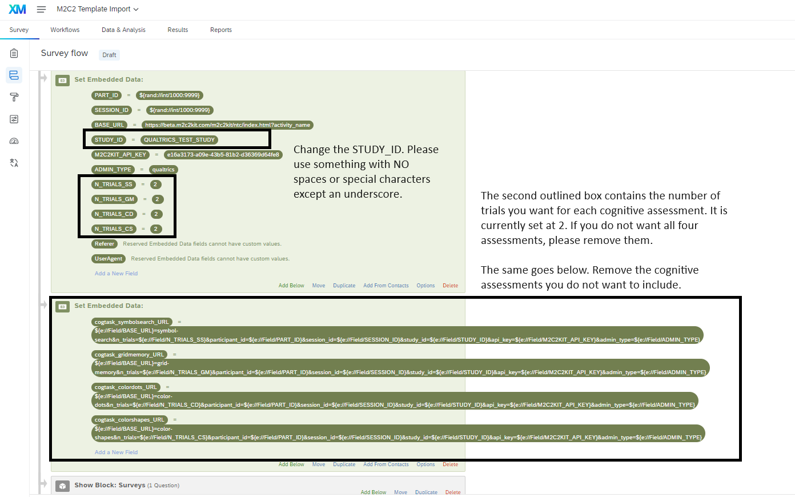

# About this Repository

With the web-based implementation of M2C2kit assessments, it is possible for them to be embedded via Qualtrics, REDCAP, and Metricwire (as well as anything else with a WebView[cite]).

This documentation page contains an implementation guide for using Qualtrics. The `templates` folder will contain examples of different ways in which you may configure m2c2kit cognitive assessments. 

## Getting Started - Using the M2C2kit Production Server

There is presently one Qualtrics `.qsf` template (`four_consecutive_cognitive_tasks_m2c2kit_backend.qsf`) that contains all four production-ready m2c2kit tasks:

- Symbol Search
- Grid Memory
- Color Shapes
- Color Dots

This template uses a randomized Participant identifier (i.e., `PART_ID`) and Session Identifier (i.e., `session_id`) - for use in the context of online experiments (e.g., on MTurk, Prolific) where you are running cross-sectional studies. If you want to recruit and follow participants longtiduinally, you'll need to use URL params instead of randomized numbers for both of those fields.

1. To import this `.qsf` file onto your Qualtrics instance, follow this guide:

https://www.qualtrics.com/support/survey-platform/survey-module/survey-tools/import-and-export-surveys/#ImportingASurvey

2. Once imported - make sure to modify the `Embedded Data` fields on the Qualtrics Survey Flow in order to create a unique `STUDY_ID` and `M2C2KIT_API_KEY`. Reach out to our team to request.

3. Thereafter, add your questions above/below the block containing the cognitive tasks.

4. Publish your Qualtrics survey and collect data!

### Data Access

Using this template would allow you to get started to collect data from m2c2kit assessments via Qualtrics.

To get your data out of our backend, please contact [Dr. Nelson Roque](nur375@psu.edu) for coordination on using our API for data extraction.

## Getting Started - Using Custom Tasks

Guide coming soon!

# Qualtrics Resources

- Passing in information via Query String
    - This method allows you to use your own Participant and Session Identifiers
    - https://www.qualtrics.com/support/survey-platform/survey-module/survey-flow/standard-elements/passing-information-through-query-strings/
